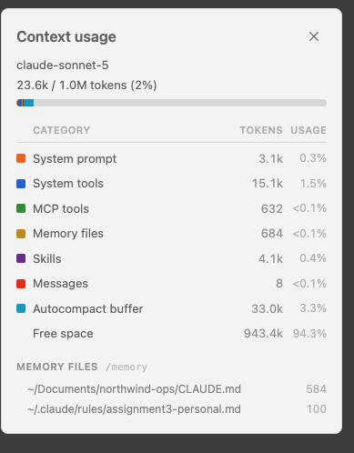
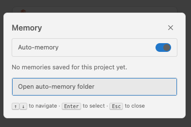

# Evidence 1: project vs user configuration

Captured with Claude Code 2.1.276 (the VS Code extension's bundled binary).

## The two files

| Scope | File | In git? | Shared with teammates? |
|---|---|---|---|
| **Project** | `CLAUDE.md` (repo root) | yes | yes, arrives with `git clone` |
| **User** | `~/.claude/rules/assignment3-personal.md` | no, it lives in the home directory | no, only on the machine that created it |

The project file sets a logging convention and boolean naming. The user rule is one line:
*start every final summary with `TL;DR:`*.

## `/context` lists both, with their scope

Run `/context` in a session started in this repo (it also runs headlessly:
`claude -p "/context"`):

```
### Memory Files
| Type    | Path                                                  | Tokens |
|---------|-------------------------------------------------------|--------|
| User    | /Users/demetrios/.claude/rules/assignment3-personal.md |     70 |
| Project | /Users/demetrios/Documents/northwind-ops/CLAUDE.md     |    447 |
```

### Screenshots (VS Code extension, session rooted in this repo)

**Project vs user files.** The `/context` panel's "Memory files" section, labelled `/memory`:



`~/Documents/northwind-ops/CLAUDE.md` is the **project** file (committed, arrives with a
clone). `~/.claude/rules/assignment3-personal.md` is the **user** file (home directory, never
committed).

**The `/memory` dialog** in the extension covers auto-memory only, and is empty for this
project, so it does not list `CLAUDE.md` or rules files. That is why the split is shown via
`/context`:



(`/memory` is interactive-only: `claude -p "/memory"` answers "isn't available in this
environment".)

## What a teammate sees

An `InstructionsLoaded` hook logged every instruction file at session start.

| Who | Setup | Files loaded |
|---|---|---|
| Teammate | fresh `git clone`, **empty** `CLAUDE_CONFIG_DIR` (no `~/.claude`) | `Project` `CLAUDE.md` only |
| Me | the same fresh clone, my normal `~/.claude` | `Project` `CLAUDE.md` **and** `User` `assignment3-personal.md` |

The user rule is not in `git ls-files`, and `grep` finds no reference to it anywhere in the
working tree. It cannot travel with a clone. That is the classic "new teammate isn't
getting our instructions" bug in reverse: an instruction placed at user level never
reaches anyone else, so anything the team needs must live at project level.

`--setting-sources project` is **not** a valid way to simulate a teammate: it still loaded
the user-level rule (mislabelled `Project`). The empty config dir is the reliable test.

## The project file visibly changes behaviour

The same prompt, run once on the commit before `CLAUDE.md` and once with it (sonnet,
Read-only tool, no edits):

> In `src/northwind/billing/refunds.py` add a function that tells whether an order is
> eligible for a refund on a given day, and record the outcome.

| | Without `CLAUDE.md` | With `CLAUDE.md` |
|---|---|---|
| Name | `is_refund_eligible` | `can_refund` |
| Logger | `logger = logging.getLogger(__name__)` | `log = logging.getLogger(__name__)` |
| Message | `"refund eligibility for order %s on %s: %s (%s)"` | `"refund_eligibility_rejected order_id=%s reason=%s"` |
| Order id | `order.id` (guessed, wrong) | `order.order_id` |

Both runs opened with `TL;DR:`, because both ran under the same user-level rule.
