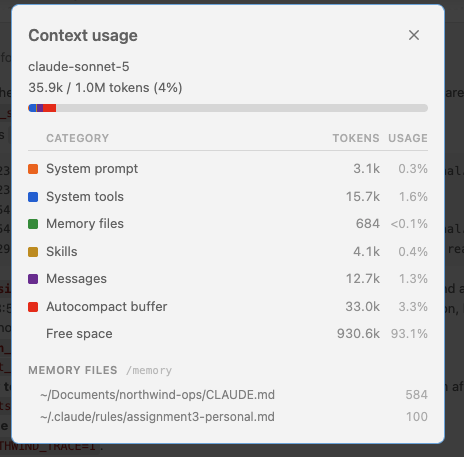

# Evidence 2: a path-scoped rule that loads only for test files

Captured with Claude Code 2.1.276, haiku, on fresh clones of this repo.

## The rule

`.claude/rules/tests.md`, with the glob in its frontmatter:

```yaml
---
paths:
  - "**/test_*.py"
---
```

The starter's tests sit next to the code they test in every package. One glob reaches all of
them:

| | files | directories |
|---|---|---|
| **matches** `**/test_*.py` | 9 test files | `billing/`, `orders/`, `shared/`, `support/` |
| **no match** | 16 other `.py` files | including `billing/refunds.py`, beside `billing/test_refunds.py` |

If the official starter uses `*.test.ts` files, the glob becomes `**/*.test.*`. The
mechanism is unchanged.

**Why a directory-bound `CLAUDE.md` cannot do this.** A `billing/CLAUDE.md` loads whenever
Claude reads *any* file under `billing/`, so it would load for `refunds.py` as well as
`test_refunds.py`. It would also have to be copied into each of the four directories. The
glob selects by file name, not by location.

## Proof: it loads on a matching file, and stays out on a non-matching one

An `InstructionsLoaded` hook (`.claude/hooks/trace-instructions.sh`, opt-in) logged every
instruction file as it loaded. Each row is a separate fresh session with Read and Edit tools
only.

| Session | Claude reads, then edits | Instruction files loaded |
|---|---|---|
| A | `src/northwind/billing/test_refunds.py` | `session_start`: `CLAUDE.md`, user rule. Then **`path_glob_match`: `.claude/rules/tests.md`**, triggered by that read |
| B | `src/northwind/support/test_tickets.py` (a different directory) | the same: `tests.md` loads via `path_glob_match` |
| D | `src/northwind/orders/test_pricing.py` (a third directory) | the same |
| C | `src/northwind/billing/refunds.py` (**same directory as A**) | `session_start` only: `CLAUDE.md`, user rule. **`tests.md` never loads** |

Raw trace for A and C (paths shortened):

```
# A: edit a matching file
17:14:13  User     session_start    ~/.claude/rules/assignment3-personal.md
17:14:13  Project  session_start    <clone>/CLAUDE.md
17:14:15  Project  path_glob_match  <clone>/.claude/rules/tests.md  <- read .../billing/test_refunds.py

# C: edit a non-matching file, same directory
17:14:48  Project  session_start    <clone>/CLAUDE.md
17:14:48  User     session_start    ~/.claude/rules/assignment3-personal.md
```

Note that the rule is *not* loaded at session start in either run. It arrives only when a
matching file is read.

## Proof: it changes what Claude writes

Both edits to test files followed the rule (`# arrange` / `# act` / `# assert`, behaviour-named
test). The docstring edit to `refunds.py` did not touch it.

```python
# A: billing/test_refunds.py (rule loaded)
def test_refund_of_500_on_600_delivered_5_days_ago_is_approved():
    # arrange
    order = _order(price="600.00", delivered_days_ago=5)
    # act
    decision = decide_refund(order, Decimal("500.00"), TODAY)
    # assert
    assert decision.approved and not decision.needs_human

# B: support/test_tickets.py (rule loaded)
def test_fraud_mention_is_urgent():
    # arrange
    ticket = _ticket("I suspect fraud on this transaction")
    # act
    priority = priority_for(ticket)
    # assert
    assert priority == "urgent"
```

| Edit | `# arrange` | `# act` | `# assert` |
|---|---|---|---|
| A: `test_refunds.py` | 1 | 1 | 1 |
| B: `test_tickets.py` | 1 | 1 | 1 |
| C: `refunds.py` (docstring) | 0 | 0 | 0 |

## Live run in the VS Code extension

Same rule, real extension session in this repo (not a scripted clone).

**Session 1: edit a matching file.** Prompt: *In `src/northwind/billing/test_refunds.py` add
one test: a refund of exactly 500.00 on a 600.00 order delivered 5 days ago is approved.*
Trace log (`<repo>` = the working copy):

```
11:13:54  Project  session_start    <repo>/CLAUDE.md
11:13:54  User     session_start    ~/.claude/rules/assignment3-personal.md
11:14:29  Project  path_glob_match  <repo>/.claude/rules/tests.md  <- read <repo>/src/northwind/billing/test_refunds.py
```

The rule is absent at `session_start` and arrives 35 seconds later, when the test file is read.
The edit Claude made follows it:

```python
def test_refund_of_exactly_the_limit_is_approved():
    # arrange
    order = _order("600.00", delivered_days_ago=5)
    # act
    decision = decide_refund(order, Decimal("500.00"), TODAY)
    # assert
    assert decision.approved
```

(`# arrange` / `# act` / `# assert` markers and a behaviour-named test; the full suite passes.)

The `11:09:23` pair of `session_start` lines belongs to an earlier session whose prompt named
the files but not a change. Claude asked what to change instead of reading a test file, so
`tests.md` never loaded. That is a small example of the rule staying out until a matching file
is read.

**The `/context` panel during Session 1** lists the two session-start files (684 tokens):



`~/Documents/northwind-ops/CLAUDE.md` (584) and `~/.claude/rules/assignment3-personal.md`
(100). Whether the panel also picks up `tests.md` after the read is unconfirmed, so the trace
log is the evidence for the path rule, not this panel.

## Reading versus editing

Path rules trigger when Claude **reads** a matching file, not on every tool call. An edit
always starts with a read, so every edit above shows `Read` then `Edit`, with the rule loading
on the `Read`. A prompt that creates a new test file without reading an existing one would not
load the rule until a matching file is read.

## Reproduce it

```bash
# personal, gitignored: switch the trace on for your sessions
echo '{"env": {"NORTHWIND_TRACE": "1"}}' > .claude/settings.local.json
tail -f /tmp/northwind-instructions-trace.log      # in a second terminal
```

Then start Claude Code in the repo, ask it to edit `src/northwind/billing/test_refunds.py`,
and then `src/northwind/billing/refunds.py`. The trace hook is inert unless
`NORTHWIND_TRACE=1`, so it costs a teammate nothing by default. The first time a project hook
runs in a folder, Claude Code asks you to trust the workspace.

## Limits

- Headless `claude -p "/context" --continue` did **not** list `tests.md` after a session that
  had loaded it, so the trace log is the evidence, not `/context`.
- Requires a Claude Code version with path-scoped rules and the `InstructionsLoaded` hook;
  these runs used 2.1.276. The `claude` on some PATHs is much older (2.1.81 here).
